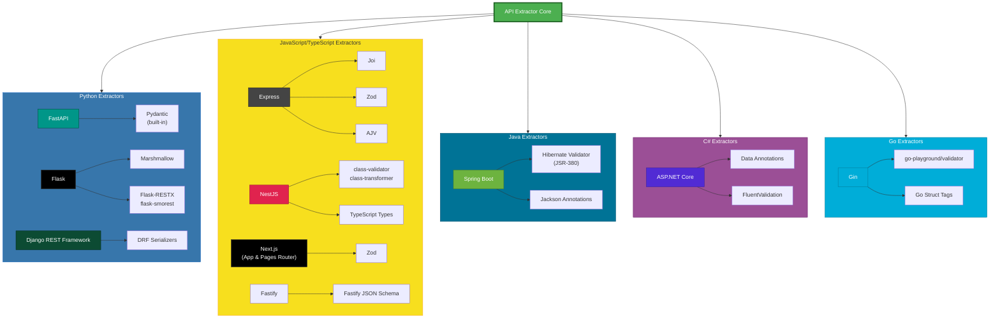

# API Extractor

Automatically extract REST API definitions from source code and generate OpenAPI specifications.

## Features

- **Automatic Framework Detection**: Detects web frameworks in your codebase
- **Multi-Language Support**: Python, JavaScript/TypeScript, Java, C#, and Go
- **OpenAPI 3.1 Output**: Generates standard OpenAPI specifications in JSON or YAML
- **Tree-sitter Based**: Uses Tree-sitter Query Language for accurate AST parsing
- **Production Validated**: Tested against real-world projects including Cal.com, Dub, Spring Boot RealWorld, and more
- **Multiple Deployment Modes**: CLI, HTTP Server, Docker, Kubernetes, AWS Lambda

## Quick Start

### Installation

```bash
pip install -r requirements.txt
pip install -e .
```

### Extract API from Local Code

```bash
api-extractor extract /path/to/project
```

### Generate YAML Output

```bash
api-extractor extract /path/to/project --output api-spec.yaml --format yaml
```

## Supported Frameworks

API Extractor supports **10 major web frameworks** across 5 languages:

| Language | Frameworks | Documentation |
|----------|------------|---------------|
| **Python** | FastAPI, Flask, Django REST | [→ Python Guide](docs/frameworks/python.md) |
| **JavaScript/TypeScript** | Express, NestJS, Fastify, Next.js | [→ JavaScript Guide](docs/frameworks/javascript.md) |
| **Java** | Spring Boot | [→ Java Guide](docs/frameworks/java.md) |
| **C#** | ASP.NET Core | [→ C# Guide](docs/frameworks/csharp.md) |
| **Go** | Gin | [→ Go Guide](docs/frameworks/go.md) |

### Framework-Specific Examples

**Next.js:**
```bash
api-extractor extract /path/to/nextjs-app --output nextjs-api.json
# Detects: app/api/ or pages/api/ directories
```

**Spring Boot:**
```bash
api-extractor extract /path/to/spring-boot-app --output spring-api.yaml --format yaml
# Detects: pom.xml, build.gradle, @RestController annotations
```

**FastAPI:**
```bash
api-extractor extract /path/to/fastapi-app --output fastapi-spec.json
# Detects: FastAPI decorators and type hints
```

## Usage Modes

API Extractor can run in three modes:

### 1. CLI Mode

Command-line tool for batch extraction from local codebases.

```bash
# Basic usage
api-extractor extract /path/to/project

# With custom output and metadata
api-extractor extract . \
  --output my-api.yaml \
  --format yaml \
  --title "My API" \
  --version "2.0.0" \
  --verbose
```

**CLI Options:**

| Option | Short | Type | Default | Description |
|--------|-------|------|---------|-------------|
| `--output` | `-o` | path | `openapi.json` | Output file path |
| `--format` | `-f` | choice | `json` | Output format (`json` or `yaml`) |
| `--verbose` | `-v` | flag | false | Show detailed extraction progress |
| `--title` | - | string | `Extracted API` | API title in OpenAPI spec |
| `--version` | - | string | `1.0.0` | API version in OpenAPI spec |

### 2. HTTP Server Mode

Run as an HTTP API server for on-demand code analysis. Ideal for sidecar deployment in containerized environments.

```bash
# Start server
api-extractor serve

# Custom configuration
api-extractor serve --host 127.0.0.1 --port 9000
```

**Use Cases:**
- Runtime API discovery
- CI/CD integration
- API gateway integration
- Service mesh integration
- Documentation automation

[→ See HTTP Server Documentation](docs/deployment/http-server.md)

### 3. AWS Lambda

Deploy as a serverless function with S3 Files filesystem mount for on-demand extraction.

```bash
cd deployment/lambda
./setup_vpc.sh
./setup_s3_files.sh
./build_lambda.sh
./deploy_lambda.sh
```

[→ See Lambda Deployment Guide](docs/deployment/lambda.md)

## Deployment Options

| Deployment | Use Case | Documentation |
|------------|----------|---------------|
| **CLI** | Local development, CI/CD pipelines | Built-in |
| **Docker** | Containerized environments | [→ Docker Guide](docs/deployment/docker.md) |
| **HTTP Server** | Sidecar pattern, service mesh | [→ HTTP Server Guide](docs/deployment/http-server.md) |
| **Kubernetes** | Production orchestration | [→ Kubernetes Guide](docs/deployment/kubernetes.md) |
| **AWS Lambda** | Serverless, on-demand extraction | [→ Lambda Guide](docs/deployment/lambda.md) |

## Example Output

Given a FastAPI application:

```python
from fastapi import FastAPI

app = FastAPI()

@app.get("/users/{user_id}")
async def get_user(user_id: int):
    return {"id": user_id}
```

Running:
```bash
api-extractor extract . --verbose
```

Generates:

```json
{
  "openapi": "3.1.0",
  "info": {
    "title": "Extracted API",
    "version": "1.0.0"
  },
  "paths": {
    "/users/{user_id}": {
      "get": {
        "tags": ["fastapi"],
        "parameters": [
          {
            "name": "user_id",
            "in": "path",
            "required": true,
            "schema": {"type": "integer"}
          }
        ],
        "responses": {
          "200": {"description": "Success"}
        }
      }
    }
  }
}
```

## Architecture

API Extractor uses **Tree-sitter Query Language** for pattern matching across multiple languages:



**Legend:**
- **Framework extractors** (darker boxes) - Parse route definitions and controller structures
- **Validation libraries** (lighter boxes) - Extract request/response schemas and validation rules
- **Multi-validation support** - Express supports Joi, Zod, and AJV simultaneously

### How It Works

1. **Parse source code into AST**: Tree-sitter parses files into abstract syntax trees
2. **Query for patterns**: Framework-specific queries match route definitions
3. **Extract route information**: HTTP methods, paths, parameters, and handlers
4. **Normalize to OpenAPI**: Routes are converted to OpenAPI 3.1 format

## Development

### Running Tests

```bash
pytest tests/ -v
```

### Running Tests with Coverage

```bash
pytest tests/ -v --cov=api_extractor --cov-report=term-missing
```

### Test Statistics

- **Total Tests**: 161 (158 passing, 3 known issues)
- **Coverage**: 82% overall

## Contributing

Contributions are welcome! To add support for a new framework:

1. Create a new extractor extending `BaseExtractor`
2. Write Tree-sitter queries to match framework patterns
3. Add test fixtures and unit tests
4. Validate against real-world projects
5. Update documentation

See existing extractors in `api_extractor/extractors/` for reference.

## Documentation

- **Framework Guides**: [docs/frameworks/](docs/frameworks/)
  - [Python](docs/frameworks/python.md) - FastAPI, Flask, Django REST
  - [JavaScript/TypeScript](docs/frameworks/javascript.md) - Express, NestJS, Fastify, Next.js
  - [Java](docs/frameworks/java.md) - Spring Boot
  - [C#](docs/frameworks/csharp.md) - ASP.NET Core
  - [Go](docs/frameworks/go.md) - Gin

- **Deployment Guides**: [docs/deployment/](docs/deployment/)
  - [Docker](docs/deployment/docker.md)
  - [HTTP Server](docs/deployment/http-server.md)
  - [Kubernetes](docs/deployment/kubernetes.md)
  - [AWS Lambda](docs/deployment/lambda.md)

- **Additional Guides**: [docs/guides/](docs/guides/)
  - [Docker Image Extraction](docs/guides/docker-extraction.md)
  - [Architecture](docs/guides/architecture.md)

## Troubleshooting

### No endpoints found

- Ensure you're running the extractor on the correct directory (source code, not build artifacts)
- Check that the framework is correctly detected with `--verbose` flag
- Verify that route decorators/annotations are using standard patterns

### Routes missing from output

- For Express: Ensure routers are defined and mounted in the same file
- For Flask: Check that Blueprint mounting (`app.register_blueprint()`) is present
- For NestJS: Verify controllers are decorated with `@Controller()` and methods with HTTP decorators
- For Spring Boot: Ensure controllers use `@RestController` or `@Controller` annotations

### Path parameters not extracted

Check that parameter syntax matches the framework:
- Express/NestJS/Fastify: `:paramName`
- Flask: `<type:paramName>` or `<paramName>`
- FastAPI: `{paramName}`
- Spring Boot/ASP.NET Core: `{paramName}`
- Gin: `:paramName`

### Performance issues

- For large codebases, consider extracting from specific subdirectories
- Manually exclude `node_modules`, `venv`, `target/`, `bin/`, etc.

## License

MIT License
