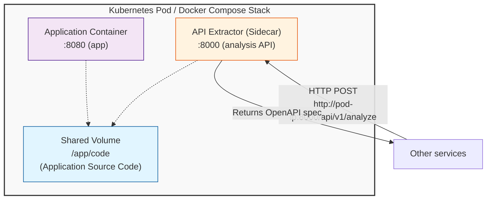

# HTTP Server Mode (Sidecar Deployment)

API Extractor can run as an HTTP server, exposing REST API endpoints for on-demand code analysis. This mode is designed for **sidecar deployment** in containerized environments, where API Extractor runs alongside your application to provide real-time API documentation and analysis capabilities.

## Use Cases

- **Runtime API Discovery**: Automatically discover and document APIs running in your cluster
- **CI/CD Integration**: Extract API specs during build/deploy pipelines
- **API Gateway Integration**: Provide OpenAPI specs to API gateways for routing and validation
- **Documentation Automation**: Generate up-to-date API documentation on every deployment
- **Service Mesh Integration**: Supply API metadata to service mesh control planes
- **Contract Testing**: Generate API contracts for consumer-driven contract testing
- **Web-based UIs**: Power interactive API exploration dashboards

## Starting the Server

```bash
api-extractor serve
```

The server will start on `http://0.0.0.0:8000` by default.

**Custom host and port:**
```bash
api-extractor serve --host 127.0.0.1 --port 9000
```

**Development mode with auto-reload:**
```bash
api-extractor serve --reload --log-level debug
```

## Sidecar Deployment Pattern

The most common deployment pattern for API Extractor is as a **sidecar container** that runs alongside your application in a Kubernetes pod or Docker Compose stack. This allows other services to discover and document your API at runtime without modifying your application code.

### Benefits of Sidecar Deployment

1. **Zero Application Changes**: No instrumentation or code changes required in your application
2. **Real-Time Analysis**: Generate OpenAPI specs on-demand when services start or change
3. **Multi-Language Support**: Works with any supported framework across Python, JavaScript/TypeScript, Java, C#, Go
4. **Shared Volume Access**: Sidecar reads application code from a shared volume
5. **Network Isolation**: API Extractor is accessible only within the pod/stack (not exposed externally)
6. **Independent Scaling**: Can be scaled independently of the application

### Architecture



## Docker Compose Example

```yaml
version: '3.8'

services:
  # Your application
  app:
    image: my-app:latest
    ports:
      - "8080:8080"
    volumes:
      - ./app-code:/app/code:ro
    networks:
      - app-network

  # API Extractor sidecar
  api-extractor:
    image: api-extractor:latest
    ports:
      - "8000:8000"
    volumes:
      - ./app-code:/app/code:ro
    environment:
      - API_EXTRACTOR_ALLOWED_PATH_PREFIXES=/app/code
      - API_EXTRACTOR_LOG_LEVEL=info
    networks:
      - app-network
    depends_on:
      - app

  # Example: API Gateway that uses the OpenAPI spec
  api-gateway:
    image: kong:latest
    ports:
      - "8001:8001"
    environment:
      - GATEWAY_API_SPEC_URL=http://api-extractor:8000/api/v1/analyze
    networks:
      - app-network
    depends_on:
      - api-extractor

networks:
  app-network:
    driver: bridge
```

**Access the API Extractor from other services:**

```bash
# From another container in the same network
curl -X POST http://api-extractor:8000/api/v1/analyze \
  -H "Content-Type: application/json" \
  -d '{"path": "/app/code"}'

# From the host machine
curl -X POST http://localhost:8000/api/v1/analyze \
  -H "Content-Type: application/json" \
  -d '{"path": "/app/code"}'
```

## Kubernetes Sidecar Example

```yaml
apiVersion: apps/v1
kind: Deployment
metadata:
  name: my-app
spec:
  template:
    spec:
      containers:
      # Main application container
      - name: app
        image: my-app:latest
        ports:
        - containerPort: 8080
        volumeMounts:
        - name: app-code
          mountPath: /app/code
          readOnly: true

      # API Extractor sidecar
      - name: api-extractor
        image: api-extractor:latest
        ports:
        - containerPort: 8000
        env:
        - name: API_EXTRACTOR_ALLOWED_PATH_PREFIXES
          value: "/app/code"
        volumeMounts:
        - name: app-code
          mountPath: /app/code
          readOnly: true

      volumes:
      - name: app-code
        emptyDir: {}
```

**Analyze the application from another service:**
```bash
curl -X POST http://my-app:8000/api/v1/analyze \
  -H "Content-Type: application/json" \
  -d '{
    "path": "/app/code",
    "title": "My App API",
    "version": "1.0.0"
  }'
```

## API Endpoints

### Health Check

**GET** `/api/v1/health`

Check if the service is healthy and responsive.

**Response:**
```json
{
  "status": "healthy",
  "version": "0.1.0"
}
```

### Service Information

**GET** `/api/v1/info`

Get information about service capabilities and supported frameworks.

**Response:**
```json
{
  "version": "0.1.0",
  "supported_frameworks": ["fastapi", "flask", "django_rest", "express", "nestjs", "fastify", "spring_boot"],
  "features": {
    "auto_detection": true,
    "multiple_frameworks": true
  }
}
```

### Analyze Codebase

**POST** `/api/v1/analyze`

The primary endpoint for extracting REST API definitions from source code and generating OpenAPI specifications.

**Key Features:**
- Automatic framework detection (10 frameworks across 5 languages)
- Multi-framework support
- OpenAPI 3.1 output
- Rich metadata with extraction statistics
- Path security validation

**Request Body:**
```json
{
  "path": "/app/code",
  "title": "My API",
  "version": "1.0.0",
  "description": "My REST API Documentation"
}
```

**Request Parameters:**

| Parameter | Type | Required | Default | Description |
|-----------|------|----------|---------|-------------|
| `path` | string | Yes | - | Path to local codebase directory |
| `title` | string | No | `"Extracted API"` | API title in OpenAPI spec |
| `version` | string | No | `"1.0.0"` | API version |
| `description` | string | No | `null` | API description |

**Success Response (200 OK):**
```json
{
  "success": true,
  "openapi_spec": {
    "openapi": "3.1.0",
    "info": {
      "title": "My API",
      "version": "1.0.0"
    },
    "paths": {
      "/api/users": {
        "get": {
          "tags": ["fastapi"],
          "operationId": "get_users",
          "responses": {
            "200": {"description": "Success"}
          }
        }
      }
    }
  },
  "endpoints_count": 5,
  "frameworks_detected": ["fastapi"],
  "errors": [],
  "warnings": ["No type hints found for parameter 'query'"],
  "metadata": {
    "source_path": "/app/code",
    "frameworks_used": ["fastapi"],
    "total_files_scanned": 12,
    "extraction_time_ms": 234
  }
}
```

**Error Responses:**

| Status Code | Description |
|-------------|-------------|
| 400 | Invalid request parameters |
| 403 | Path security violation (directory traversal, system directories) |
| 404 | Path does not exist |
| 422 | Validation error |
| 500 | Internal server error |

## Interactive Documentation

API documentation is automatically generated and available at:

- **Swagger UI**: `http://localhost:8000/docs`
- **ReDoc**: `http://localhost:8000/redoc`
- **OpenAPI JSON**: `http://localhost:8000/openapi.json`

## Usage Examples

### Using curl

```bash
# Analyze local codebase
curl -X POST http://localhost:8000/api/v1/analyze \
  -H "Content-Type: application/json" \
  -d '{"path": "/path/to/code"}'

# Health check
curl http://localhost:8000/api/v1/health
```

### Using Python

```python
import requests

response = requests.post(
    "http://localhost:8000/api/v1/analyze",
    json={
        "path": "/path/to/code",
        "title": "My API",
        "version": "1.0.0"
    }
)

result = response.json()
if result["success"]:
    print(f"Found {result['endpoints_count']} endpoints")
    print(result["openapi_spec"])
```

## Real-World Integration Examples

### API Gateway Auto-Configuration

```python
# api-gateway-config.py
import requests

# Get OpenAPI spec from sidecar
response = requests.post(
    "http://api-extractor:8000/api/v1/analyze",
    json={
        "path": "/app/code",
        "title": "User Service API",
        "version": "1.0.0"
    }
)

spec = response.json()

if spec["success"]:
    # Configure API Gateway
    gateway_response = requests.post(
        "http://api-gateway:8001/services",
        json={
            "name": "user-service",
            "openapi_spec": spec["openapi_spec"]
        }
    )
    print(f"✓ Configured {spec['endpoints_count']} endpoints")
```

### Service Mesh Registration

```python
# service-mesh-register.py
import requests

response = requests.post(
    "http://api-extractor:8000/api/v1/analyze",
    json={"path": "/app/code"}
)

spec = response.json()

if spec["success"]:
    openapi = spec["openapi_spec"]

    # Register each endpoint with service mesh
    for path, methods in openapi["paths"].items():
        for method, details in methods.items():
            route_config = {
                "service": "user-service",
                "path": path,
                "method": method.upper(),
                "tags": details.get("tags", [])
            }
            requests.post(
                "http://service-mesh-control-plane:9090/routes",
                json=route_config
            )

    print(f"✓ Registered {spec['endpoints_count']} routes")
```

### Continuous Documentation Updates

```bash
#!/bin/bash
# update-docs.sh - CI/CD pipeline script

API_EXTRACTOR_URL="http://localhost:8000"

# Extract OpenAPI spec
OPENAPI_SPEC=$(curl -s -X POST "$API_EXTRACTOR_URL/api/v1/analyze" \
  -H "Content-Type: application/json" \
  -d '{
    "path": "/app/code",
    "title": "'"$SERVICE_NAME"' API",
    "version": "'"$APP_VERSION"'"
  }' | jq -r '.openapi_spec')

# Generate documentation
echo "$OPENAPI_SPEC" > /docs/openapi.json
npx @redocly/cli build-docs /docs/openapi.json -o /docs/index.html

# Upload to docs site
aws s3 cp /docs/index.html s3://docs-bucket/services/$SERVICE_NAME/

echo "✓ Documentation updated"
```

### Init Container Pattern

```yaml
apiVersion: apps/v1
kind: Deployment
metadata:
  name: user-service
spec:
  template:
    spec:
      # Extract spec before app starts
      initContainers:
      - name: extract-api-spec
        image: api-extractor:latest
        command:
        - sh
        - -c
        - |
          api-extractor extract /app/code \
            --output /specs/openapi.json \
            --title "User Service API" \
            --version "$APP_VERSION"

          if [ ! -f /specs/openapi.json ]; then
            echo "Failed to extract OpenAPI spec"
            exit 1
          fi
        volumeMounts:
        - name: app-code
          mountPath: /app/code
          readOnly: true
        - name: api-specs
          mountPath: /specs

      containers:
      - name: app
        image: user-service:latest
        volumeMounts:
        - name: api-specs
          mountPath: /specs
          readOnly: true
        env:
        - name: OPENAPI_SPEC_PATH
          value: /specs/openapi.json

      volumes:
      - name: app-code
        emptyDir: {}
      - name: api-specs
        emptyDir: {}
```

## Configuration

### Environment Variables

| Variable | Default | Description |
|----------|---------|-------------|
| `API_EXTRACTOR_HOST` | `0.0.0.0` | Server host |
| `API_EXTRACTOR_PORT` | `8000` | Server port |
| `API_EXTRACTOR_LOG_LEVEL` | `info` | Logging level (`debug`, `info`, `warning`, `error`) |
| `API_EXTRACTOR_ALLOWED_PATH_PREFIXES` | (empty) | Comma-separated whitelist of allowed path prefixes |

**Example:**
```bash
export API_EXTRACTOR_HOST=127.0.0.1
export API_EXTRACTOR_PORT=9000
export API_EXTRACTOR_LOG_LEVEL=debug
export API_EXTRACTOR_ALLOWED_PATH_PREFIXES=/app/code,/tmp
api-extractor serve
```

## Security

The HTTP server includes several security features:

1. **Path Traversal Prevention**: Blocks paths containing `..` or `~`
2. **System Directory Protection**: Forbidden paths:
   - `/etc`, `/usr`, `/bin`, `/sbin`, `/root`
   - `/boot`, `/sys`, `/proc`, `/dev`
3. **Path Whitelist**: Optional whitelist via `API_EXTRACTOR_ALLOWED_PATH_PREFIXES`

**Example security configuration:**
```bash
# Only allow analysis of /app/code and /tmp
export API_EXTRACTOR_ALLOWED_PATH_PREFIXES=/app/code,/tmp
api-extractor serve
```

## Troubleshooting

### Server won't start

- Check if port 8000 is already in use: `lsof -i :8000`
- Try a different port: `api-extractor serve --port 9000`

### 403 Forbidden errors

- Check path whitelist configuration
- Verify path doesn't contain `..` or point to system directories
- Add path to `API_EXTRACTOR_ALLOWED_PATH_PREFIXES`

### No endpoints found

- Verify the path points to source code (not build artifacts)
- Check framework detection with `--log-level debug`
- Ensure source code is mounted correctly in the volume

### Performance issues

- For large codebases, increase timeout settings
- Consider using specific subdirectories instead of root
- Exclude `node_modules`, `venv`, etc. at the volume mount level

## See Also

- [Docker Deployment](docker.md) - Docker and Docker Compose setup
- [Kubernetes Deployment](kubernetes.md) - Production Kubernetes configuration
- [AWS Lambda Deployment](lambda.md) - Serverless deployment
