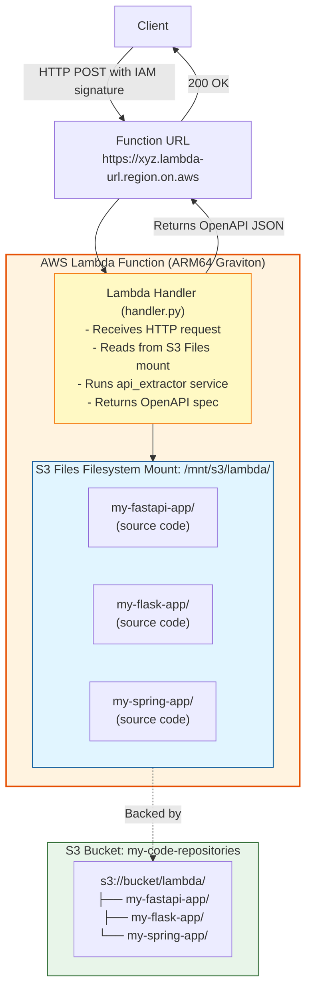

# AWS Lambda Deployment

API Extractor can be deployed as an AWS Lambda function with Function URL for HTTP access. This serverless deployment pattern is ideal for on-demand API extraction without managing servers.

## Architecture Overview

The Lambda deployment uses three key AWS services:

1. **Lambda Function** - Runs the API extraction code in a serverless environment
2. **Function URL** - Provides an HTTPS endpoint with IAM authentication
3. **S3 Files** - Mounts an S3 bucket as a filesystem at `/mnt/s3` for reading source code



### Request Flow

1. Client sends HTTP POST to Function URL with AWS IAM signatures
2. Lambda receives request via Function URL (API Gateway is not used)
3. Handler reads `folder` parameter from request body
4. Handler accesses `/mnt/s3/lambda/{folder}` via S3 Files mount
5. Extraction service analyzes code and generates OpenAPI spec
6. Lambda returns OpenAPI spec in HTTP response

## Key Features

### Function URL

AWS Lambda Function URLs provide built-in HTTPS endpoints without needing API Gateway:

- **Direct HTTP Access**: Each Lambda function gets a unique HTTPS URL
- **IAM Authentication**: Secured with AWS signature v4 (AWS_IAM auth type)
- **Low Latency**: Direct invocation without API Gateway overhead
- **No Additional Cost**: Included with Lambda pricing, no API Gateway charges
- **CORS Support**: Configurable cross-origin access for web clients

**URL Format:**
```
https://{url-id}.lambda-url.{region}.on.aws/
```

**Authentication:**
- All requests must be signed with AWS credentials (AWS Signature Version 4)
- Use AWS SDKs, AWS CLI, or `awscurl` to sign requests automatically
- IAM policies control which users/roles can invoke the function

### S3 Files (S3 as Filesystem)

S3 Files is an AWS service that mounts S3 buckets as POSIX filesystems in Lambda:

- **Standard File APIs**: Access S3 objects using `open()`, `Path()`, and other filesystem operations
- **No Downloads**: No need to download code from S3 before processing - read directly from mount
- **Automatic Caching**: S3 Files caches frequently accessed files for better performance
- **Cost Efficient**: Only pay for data transfer and API calls, no storage duplication
- **Large Files**: Supports files up to 5 TB in S3
- **VPC Required**: S3 Files requires Lambda to run in a VPC with private subnets

**How it works:**

1. S3 bucket `my-code-repositories` contains project folders in `lambda/` prefix
2. S3 Files mounts the bucket at `/mnt/s3` inside the Lambda execution environment
3. Lambda reads code using standard filesystem operations: `/mnt/s3/lambda/my-project/`
4. No explicit S3 API calls needed in the Lambda handler code

**Benefits over direct S3 access:**
- Simpler code - use `Path()` instead of `boto3.client('s3')`
- Better performance - automatic caching and prefetching
- Works with existing file-based tools without modification

### VPC Configuration

Lambda runs in a VPC with private subnets to access S3 Files:

- **Private Subnets**: Lambda runs in subnets without internet access
- **NAT Gateway**: Not required for S3 Files access (uses VPC endpoints)
- **Security Groups**: Control network access to/from Lambda
- **S3 VPC Endpoint**: Direct S3 access without internet gateway

## File Structure

Lambda files are organized into two directories:

**Python Lambda Code** (`api_extractor/lambda/`):
```
api_extractor/lambda/
├── handler.py           # Lambda entry point
└── requirements.txt     # Lambda dependencies
```

**Deployment Scripts** (`deployment/lambda/`):
```
deployment/lambda/
├── config.sh              # AWS configuration
├── build_lambda.sh        # Build ARM64 package
├── deploy_lambda.sh       # Deploy to AWS
├── setup_vpc.sh           # Create VPC
├── setup_s3_files.sh      # Create S3 Files filesystem
├── setup_s3_files.py      # S3 Files setup helper
├── attach_s3_files.sh     # Attach filesystem to Lambda
├── create_function_url.sh # Create Function URL
├── cleanup.sh             # Delete Lambda function
├── cleanup_vpc.sh         # Delete VPC resources
├── test_lambda_local.py   # Local testing
├── test_lambda_remote.sh  # Remote testing
└── QUICK_START.md         # Quick reference guide
```

## Prerequisites

1. **AWS CLI** configured with credentials:
   ```bash
   aws configure
   ```

2. **Docker** for building ARM64 package:
   ```bash
   docker --version
   ```

3. **IAM Permissions** to create:
   - Lambda functions
   - IAM roles
   - VPC resources
   - S3 buckets
   - S3 Files filesystems

## Quick Start

### 1. Configure Deployment

Edit `deployment/lambda/config.sh`:

```bash
# Lambda Configuration
export FUNCTION_NAME=api-extractor
export AWS_REGION=eu-north-1

# S3 Configuration
export S3_BUCKET_NAME=my-code-repositories

# Lambda Settings
export LAMBDA_TIMEOUT=300    # seconds (5 minutes)
export LAMBDA_MEMORY=1024    # MB
```

### 2. Create VPC

Set up VPC with private subnets for S3 Files:

```bash
cd deployment/lambda
./setup_vpc.sh
```

This creates:
- VPC with CIDR 10.0.0.0/16
- 2 private subnets in different availability zones
- Security group allowing outbound HTTPS
- VPC endpoint for S3 access

The script updates `config.sh` with VPC IDs automatically.

### 3. Create S3 Bucket and Upload Code

```bash
# Create S3 bucket (if needed)
aws s3 mb s3://my-code-repositories

# Upload project code to S3 under lambda/ prefix
aws s3 cp --recursive ./my-fastapi-app s3://my-code-repositories/lambda/my-fastapi-app/
aws s3 cp --recursive ./my-flask-app s3://my-code-repositories/lambda/my-flask-app/

# Verify upload
aws s3 ls s3://my-code-repositories/lambda/
```

**Important**: All projects must be uploaded under the `lambda/` prefix in S3. The Lambda handler expects paths like `/mnt/s3/lambda/{folder}/`.

### 4. Setup S3 Files Filesystem

Create S3 Files filesystem and mount configuration:

```bash
./setup_s3_files.sh
```

This creates:
- S3 Files filesystem
- IAM role with S3 and S3 Files permissions
- Access point linked to S3 bucket

The script updates `config.sh` with filesystem IDs automatically.

### 5. Build and Deploy Lambda

```bash
# Build ARM64 package with Docker
./build_lambda.sh

# Deploy to AWS
./deploy_lambda.sh
```

The build process:
- Uses Docker with `public.ecr.aws/lambda/python:3.11-arm64` image
- Installs dependencies for ARM64 architecture (Graviton processors)
- Packages `api_extractor` module and `handler.py`
- Creates `lambda-function.zip` (typically 15-20 MB)

The deploy process:
- Creates IAM role with Lambda, VPC, S3, and S3 Files permissions
- Creates or updates Lambda function
- Configures VPC networking
- Sets environment variables

### 6. Attach S3 Files to Lambda

Mount the S3 Files filesystem at `/mnt/s3`:

```bash
./attach_s3_files.sh
```

This:
- Creates EFS File System Configuration linking S3 Files access point
- Mounts filesystem at `/mnt/s3` in Lambda environment
- Updates Lambda function configuration

**Important**: Lambda must be deployed before attaching S3 Files.

### 7. Create Function URL

Enable HTTP access with IAM authentication:

```bash
./create_function_url.sh
```

This creates a Function URL with:
- Auth Type: `AWS_IAM` (requires signed requests)
- CORS: Enabled for cross-origin access

The script outputs the Function URL:
```
Function URL: https://abc123xyz.lambda-url.eu-north-1.on.aws/
```

**Save this URL** - you'll need it to invoke the Lambda function.

## Usage

### Request Format

Send a POST request with JSON body:

```json
{
  "folder": "my-fastapi-app",
  "title": "My FastAPI Application",
  "version": "2.0.0",
  "description": "Production API for FastAPI app"
}
```

**Request Parameters:**

| Parameter | Type | Required | Default | Description |
|-----------|------|----------|---------|-------------|
| `folder` | string | Yes | - | Folder name under `/mnt/s3/lambda/` to analyze |
| `title` | string | No | `"Extracted API"` | OpenAPI spec title |
| `version` | string | No | `"1.0.0"` | API version |
| `description` | string | No | `null` | API description |

**Important**: The `folder` parameter should match the folder name in S3:
- S3 path: `s3://my-code-repositories/lambda/my-fastapi-app/`
- Request: `{"folder": "my-fastapi-app"}`
- Lambda reads: `/mnt/s3/lambda/my-fastapi-app/`

### Using awscurl (Recommended)

Install `awscurl` for automatic AWS signature signing:

```bash
pip install awscurl
```

Make a request:

```bash
# Get Function URL
FUNCTION_URL=$(aws lambda get-function-url-config \
  --function-name api-extractor \
  --query 'FunctionUrl' \
  --output text)

# Extract API from folder
awscurl --service lambda --region eu-north-1 -X POST \
  -H "Content-Type: application/json" \
  -d '{"folder": "my-fastapi-app"}' \
  "$FUNCTION_URL"
```

Full example:

```bash
awscurl --service lambda --region eu-north-1 -X POST \
  -H "Content-Type: application/json" \
  -d '{
    "folder": "my-spring-boot-app",
    "title": "Spring Boot RealWorld API",
    "version": "1.0.0",
    "description": "RealWorld backend implementation"
  }' \
  "$FUNCTION_URL"
```

### Using AWS CLI

Invoke Lambda directly (response is Base64-encoded):

```bash
aws lambda invoke \
  --function-name api-extractor \
  --payload '{"folder": "my-fastapi-app"}' \
  response.json

# View response
cat response.json
```

### Using Python boto3

```python
import boto3
import json

client = boto3.client('lambda', region_name='eu-north-1')

response = client.invoke(
    FunctionName='api-extractor',
    InvocationType='RequestResponse',
    Payload=json.dumps({
        'folder': 'my-fastapi-app',
        'title': 'My API',
        'version': '1.0.0'
    })
)

result = json.loads(response['Payload'].read())
print(json.dumps(result, indent=2))
```

### Using Python requests with AWS Signature

```python
import requests
from aws_requests_auth.aws_auth import AWSRequestsAuth
import json

# Get credentials from environment or ~/.aws/credentials
auth = AWSRequestsAuth(
    aws_access_key='YOUR_ACCESS_KEY',
    aws_secret_access_key='YOUR_SECRET_KEY',
    aws_host='abc123xyz.lambda-url.eu-north-1.on.aws',
    aws_region='eu-north-1',
    aws_service='lambda'
)

response = requests.post(
    'https://abc123xyz.lambda-url.eu-north-1.on.aws/',
    auth=auth,
    json={'folder': 'my-fastapi-app'}
)

openapi_spec = response.json()
print(json.dumps(openapi_spec, indent=2))
```

## Response Format

### Success Response (200)

```json
{
  "statusCode": 200,
  "headers": {
    "Content-Type": "application/json",
    "X-Endpoints-Count": "15",
    "X-Frameworks": "fastapi"
  },
  "body": "{\"openapi\":\"3.1.0\",\"info\":{\"title\":\"My API\",\"version\":\"1.0.0\"},...}"
}
```

The `body` field contains a JSON-serialized OpenAPI 3.1.0 specification.

### Error Responses

**404 - Folder Not Found:**
```json
{
  "statusCode": 404,
  "headers": {"Content-Type": "application/json"},
  "body": "{\"error\": \"Folder not found: my-project\"}"
}
```

**400 - Invalid Request:**
```json
{
  "statusCode": 400,
  "headers": {"Content-Type": "application/json"},
  "body": "{\"error\": \"Missing required field: 'folder'\"}"
}
```

**500 - S3 Files Not Mounted:**
```json
{
  "statusCode": 500,
  "headers": {"Content-Type": "application/json"},
  "body": "{\"error\": \"S3 filesystem not mounted at /mnt/s3\"}"
}
```

**422 - Extraction Failed:**
```json
{
  "statusCode": 422,
  "headers": {"Content-Type": "application/json"},
  "body": "{\"error\": \"Extraction failed\", \"errors\": [...], \"warnings\": [...]}"
}
```

## Monitoring and Logs

### View Logs

**Real-time logs:**
```bash
aws logs tail /aws/lambda/api-extractor --follow
```

**Recent logs:**
```bash
# Last 10 minutes
aws logs tail /aws/lambda/api-extractor --since 10m

# Last hour
aws logs tail /aws/lambda/api-extractor --since 1h
```

**Filter logs:**
```bash
# Show errors only
aws logs tail /aws/lambda/api-extractor --filter-pattern "ERROR"

# Show specific folder extractions
aws logs tail /aws/lambda/api-extractor --filter-pattern "my-fastapi-app"
```

### CloudWatch Metrics

View Lambda metrics in CloudWatch console:
- Invocations
- Duration
- Errors
- Throttles
- Concurrent executions

## Configuration

### Environment Variables

Set in Lambda function configuration:

| Variable | Default | Description |
|----------|---------|-------------|
| `S3_MOUNT_PATH` | `/mnt/s3` | S3 Files mount point |

Update environment variables:

```bash
aws lambda update-function-configuration \
  --function-name api-extractor \
  --environment Variables="{S3_MOUNT_PATH=/mnt/s3}"
```

### Lambda Settings

Update timeout (default 300 seconds):

```bash
aws lambda update-function-configuration \
  --function-name api-extractor \
  --timeout 600
```

Update memory (default 1024 MB):

```bash
aws lambda update-function-configuration \
  --function-name api-extractor \
  --memory-size 2048
```

### IAM Permissions

The Lambda function needs permissions for:

1. **Lambda Execution**:
   - `AWSLambdaBasicExecutionRole` - CloudWatch Logs
   - `AWSLambdaVPCAccessExecutionRole` - VPC networking

2. **S3 Access**:
   - `s3:GetObject` - Read objects from S3 bucket
   - `s3:ListBucket` - List bucket contents

3. **S3 Files Access**:
   - `s3files:DescribeFileSystem` - Access filesystem metadata
   - `s3files:DescribeAccessPoint` - Access mount point

The `deploy_lambda.sh` script creates these permissions automatically.

## Updating

### Update Lambda Code

```bash
# Rebuild and redeploy
cd deployment/lambda
./build_lambda.sh
./deploy_lambda.sh
```

### Update Code in S3

```bash
# Upload updated project code
aws s3 sync ./my-fastapi-app s3://my-code-repositories/lambda/my-fastapi-app/

# S3 Files will automatically reflect changes
# No Lambda restart needed
```

### Update Configuration

```bash
# Edit config
nano config.sh

# Redeploy
./deploy_lambda.sh
```

## Testing

### Test Locally

Run Lambda handler locally (requires uploaded code in S3):

```bash
cd deployment/lambda
python test_lambda_local.py
```

### Test Remote Lambda

```bash
# Test with default folder
./test_lambda_remote.sh

# Test specific folder
./test_lambda_remote.sh my-spring-boot-app
```

## Cleanup

### Delete Lambda Function Only

```bash
cd deployment/lambda
./cleanup.sh
```

This removes:
- Lambda function
- Lambda IAM role
- Function URL

Keeps:
- VPC and subnets
- S3 bucket and contents
- S3 Files filesystem

### Full Cleanup

```bash
# Delete Lambda
./cleanup.sh

# Delete S3 Files
aws s3files delete-file-system --file-system-id $FILE_SYSTEM_ID
aws iam delete-role --role-name api-extractor-s3files-role

# Delete VPC
./cleanup_vpc.sh

# Delete S3 bucket (WARNING: deletes all code)
aws s3 rb s3://my-code-repositories --force
```

## Troubleshooting

### S3 filesystem not mounted

**Error:**
```json
{"error": "S3 filesystem not mounted at /mnt/s3"}
```

**Solution:**
```bash
cd deployment/lambda
./attach_s3_files.sh
```

Verify mount:
```bash
aws lambda get-function-configuration \
  --function-name api-extractor \
  --query 'FileSystemConfigs'
```

### Folder not found

**Error:**
```json
{"error": "Folder not found: my-project"}
```

**Solution:**

Check S3 bucket structure:
```bash
aws s3 ls s3://my-code-repositories/lambda/
```

Ensure folder exists under `lambda/` prefix:
```bash
aws s3 cp --recursive ./my-project s3://my-code-repositories/lambda/my-project/
```

### Task timed out

**Error:**
```
Task timed out after 300.00 seconds
```

**Solution:**

Increase timeout:
```bash
# Edit config.sh
export LAMBDA_TIMEOUT=600

# Redeploy
./deploy_lambda.sh
```

Or update directly:
```bash
aws lambda update-function-configuration \
  --function-name api-extractor \
  --timeout 600
```

### Permission denied errors

**Error:**
```
Access Denied (Service: S3Files)
```

**Solution:**

Check IAM role permissions:
```bash
aws iam list-attached-role-policies \
  --role-name api-extractor-role
```

Re-run setup:
```bash
./setup_s3_files.sh
./deploy_lambda.sh
```

### VPC connectivity issues

**Error:**
```
Task timed out (no logs)
```

**Solution:**

Verify VPC configuration:
```bash
aws lambda get-function-configuration \
  --function-name api-extractor \
  --query 'VpcConfig'
```

Check security group allows outbound HTTPS:
```bash
aws ec2 describe-security-groups \
  --group-ids $SECURITY_GROUP_ID
```

## Cost Estimation

AWS Lambda pricing (as of 2024):

| Component | Cost | Notes |
|-----------|------|-------|
| **Lambda Requests** | $0.20 per 1M requests | First 1M free per month |
| **Lambda Compute** | $0.0000133334 per GB-second (ARM64) | First 400,000 GB-seconds free per month |
| **S3 Storage** | $0.023 per GB/month | Standard storage |
| **S3 Files** | $0.08 per GB transferred | Data transfer from S3 to Lambda |
| **VPC** | Free | No NAT Gateway needed |

**Example calculation** (1024 MB, 30-second execution):

- 1000 requests/month: $0.20
- Compute (1024 MB × 30s × 1000): $0.41
- S3 storage (10 GB): $0.23
- S3 Files transfer (100 MB per request × 1000): $8.00

**Total: ~$8.84/month** for 1000 requests

**Free Tier:**
- First 1M requests free
- First 400,000 GB-seconds free (~13,000 requests at 1024 MB × 30s)

## Advantages

1. **Serverless** - No server management, automatic scaling
2. **Cost-Efficient** - Pay only for actual execution time
3. **Low Latency** - Function URL provides direct HTTP access
4. **S3 Integration** - S3 Files mounts buckets as filesystem
5. **Secure** - IAM authentication, VPC isolation
6. **ARM64** - Graviton processors for better price/performance

## Limitations

1. **Cold Starts** - First request after idle period is slower (3-5 seconds)
2. **Timeout** - Maximum 15 minutes execution time
3. **Memory** - Maximum 10 GB memory
4. **VPC Required** - S3 Files requires VPC configuration
5. **Large Projects** - Very large codebases may exceed timeout

For production workloads with consistent traffic, consider the [HTTP Server Mode](http-server.md) with Docker/Kubernetes instead.

## See Also

- [HTTP Server Guide](http-server.md) - HTTP API for on-demand analysis
- [Docker Deployment](docker.md) - Containerized deployment
- [Kubernetes Deployment](kubernetes.md) - Production orchestration
